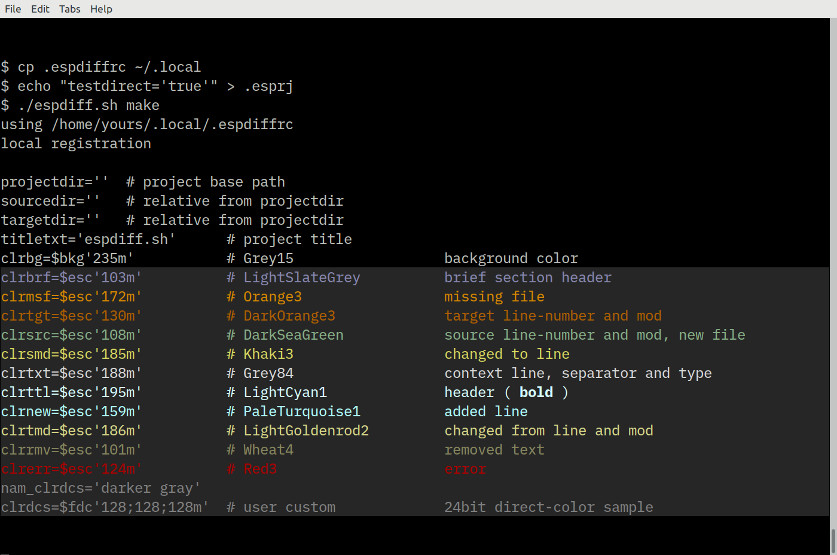

# espdiff.sh

**A contemporary take on diff, the terminal control sequence and shell scripting in color**

operate in situ on limited resource systems or within restrictive environments

need to know when it's time to wrap it up and archive an interim version?

something amiss? quickly see which file contains spurious punctuation

simply want to check whether your terminal supports 24bit direct-color?

- project-based and standalone modality
- visually assess progress on small projects or changes in files and directories
- persistently remembers the most recent project registration
- each project register may specify a custom palette

- 256color and 24bit direct-color support
- ECMA-48 conformance
- side-by-side human oriented output
- tested with xterm, lxterminal, rxvt, screen, tmux
- documentation is built into the script file, including a footnote


## getting started

**extract example tarball:**

`tar -xf example.tar`

**test basic function:**

`bash espdiff.sh example/previous/version-2/fileA example/previous/version-1/fileA`


[](screenshots/example.png)


**make script executable:**

`chmod u+x espdiff.sh`

`./espdiff.sh`


[](screenshots/example2.png)


**to include color name index:**

`cp .espdiffrc ~/.local/`

**if terminal supports 24-bit direct-color:**

`echo "testdirect='true'" >> .esprj`

**view the register:**

`./espdiff.sh make`


[](screenshots/make.esprj.png)


**color swatch and ramp:**

`./espdiff.sh colors`


```
  footnote

  xterm
    TERM='xterm-256color'
    menus C-left/right mouse

  tmux
    TERM='screen-256color' or 'tmux-256color'
    scrollback C-b [

  screen
    24bit direct-color in master branch (at least since 4.99)
    TERM='screen-256color'
    bce is not enabled by default
    C-a : bce on, or insert 'bce on' line into screenrc file

  less
    fast - files do not have to load completely before display begins
    caveat: no color buffer for hidden lines
    (scroll-back coloring is reversed)

  256color index
    lookup tables shipped onboard a vga graphics card eprom
    rgb levels were originally preconfigured to suit crt display hardware
    variation today can result from algorithm discrepancy or preference
   0-7 first 8 - ANSI color names, linux kernel system palette
    color selection was limited to this range initially
   8-15 next 8 - bright versions of first 8 colors, or may be bold font
    terminal themes are implemented in the first sixteen colors
   16-231 color cube - six intensity levels for  r, g, b  coordinates
    decimal  0, 95, 135, 175, 215, 255  (00, 5f, 87, af, d7, ff hex)
   232-255 greyscale - 24 shades,  8+(10*shade)
    8, 8, 8  -  238, 238, 238

  busybox
    if busybox is the default system shell:
     change shebang to !/bin/sh
     install iconv and full versions of builtins diff, less
    distribution binary does not pass unit tests A or B:
     compile busybox-1.32.1 (latest stable)
      make defconfig
      make menuconfig - add or remove functionality/builtins*
      make

  unit tests - first line describes correct result

    A) displays 'one' after 1 second duration
    sleep 3 && echo three & sleep 1 & wait -n; echo one
      wrong: displays 'one' immediately

    B) displays 'qwe'
    a='asdfqwerty'; echo ${a:4:-3}
      error:
      sh: Illegal number: -3
    ${ substring expansion variable : offset parameter : -length is negative }
      in Bash since 4.2-alpha, busybox?

  troubleshooting & theory of operation
   determine exact offset to the middle column in side-by-side diff output
   this is expected to be standard for any implemented diff
   using offset, grep provides line numbers, discarding unselected context
   line is then split in half, colorized and reassembled
```


###### screenshot font is IBM Plex Mono Text
