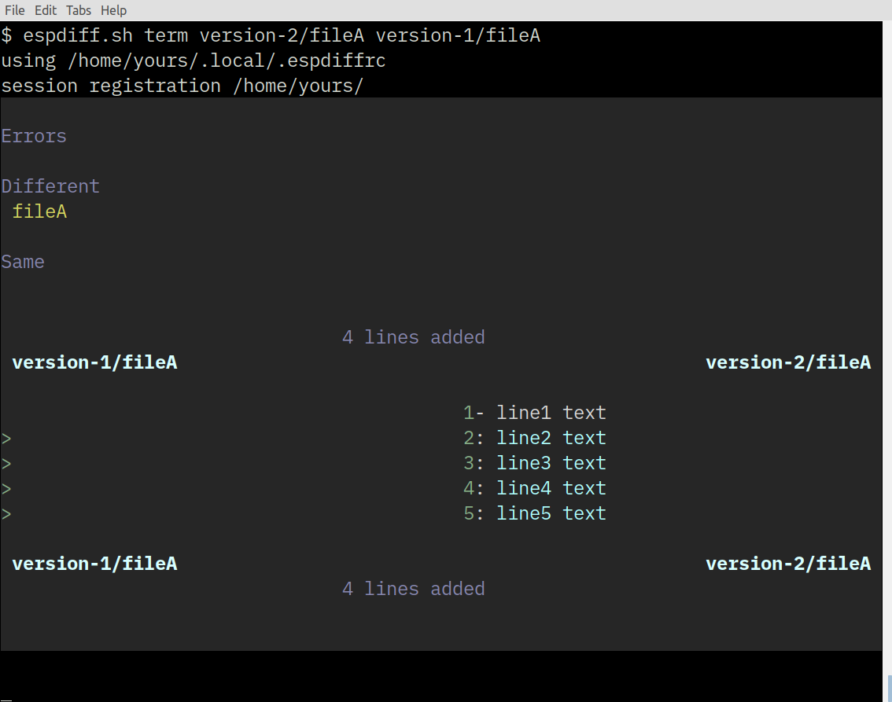

# espdiff.sh

**A contemporary take on diff, the terminal control sequence and shell scripting in color**
- documentation is built into the script file, including a footnote

# getting started

**extract example tarball:**

tar -xf example.tar

**test basic function:**

bash espdiff.sh example/previous/version-2/fileA example/previous/version-1/fileA

**make script executable:**

chmod u+x espdiff.sh

./espdiff.sh

**to include color name index:**

cp .espdiffrc ~/.local/

**if terminal supports 24-bit direct-color:**

echo "testdirect='true'" >> .esprj

**view the register:**

./espdiff.sh make

**color swatch and ramp:**

./espdiff.sh colors

